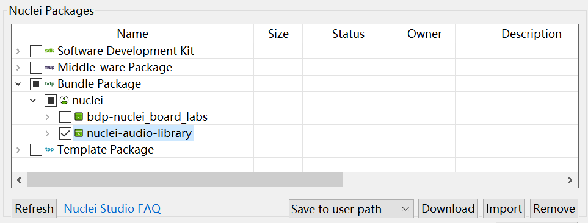
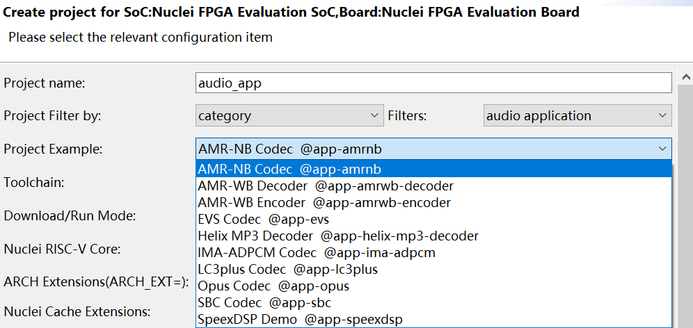

# Nuclei Audio Library

A collection of audio processing algorithms optimized for the Nuclei RISC-V
processor architecture.

This library provides a suite of codecs and digital signal processing libraries
tailored for embedded systems. It leverages RISC-V extensions (such as the
P-extension and Vector extension) to achieve high-performance and low-power
audio processing.

## Core Components

- AMR-NB: [Adaptive Multi-Rate Narrowband Codec](./AMR-NB/).
- AMR-WB: [Adaptive Multi-Rate Wideband Codec](./AMR-WB). [Encoder](./AMR-WB/amrwb_enc/)
  & [Decoder](./AMR-WB/amrwb_dec/)
- EVS: [Enhanced Voice Services Codec](./EVS/)
- ADPCM: Adaptive Differential Pulse-Code Modulation. [IMA-ADPCM codec](./ADPCM/IMA/)
- MP3: [Helix MP3 Decoder](./MP3/Helix/)
- SBC: [Sub-Band Codec](./SBC/)
- Opus: [Opus Interactive Audio Codec](./Opus/)
- LC3plus: [Low Complexity Communication Codec](./LC3plus/)
- [SpeexDSP](./SpeexDSP/): Noise Reduction, Acoustic Echo Cancellation,
  Automatic Gain Control ...

## Prerequests

To build and use this library, the Nuclei bare-metal development environment is required.

1. Required Tools:

    - [Nuclei SDK version 0.8.1](https://github.com/Nuclei-Software/nuclei-sdk/releases/tag/0.8.1)
    - [Nuclei Studio IDE: 2025.02](https://download.nucleisys.com/upload/files/nucleistudio/NucleiStudio_IDE_202502-lin64.tgz)
    (Linux recommended)

2. How to Use:

    Following the [Nuclei SDK Quick Startup](https://doc.nucleisys.com/nuclei_sdk/quickstart.html)
    to configure your toolchain.

> [!NOTE]
> A **Linux x86_64** host is recommended, as some prebuilt binaries for test data
> generation are provided for this environment.

## Run on Nuclei Studio IDE

The Nuclei Audio Library can be imported into the Nuclei Studio IDE as an `npk` package.
You can quickly create demo projects in the IDE by following these steps:

1. Open the **Nuclei Package Manager** in Nuclei Studio IDE.
2. Download the `nuclei-audio-library` package or import the ZIP file of this repository
    
3. Create a new **Nuclei RISC-V C/C++ project** and select an example filtered
by the `audio application` category
    
4. Then you can run or debug the project as usual.

## License

Nuclei Audio Library is licensed under Apache-2.0.
