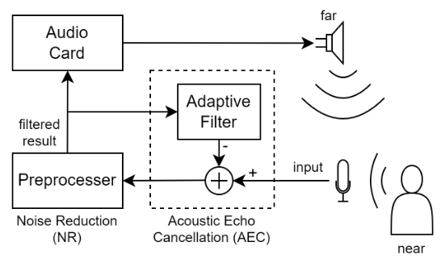
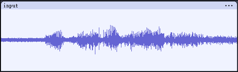
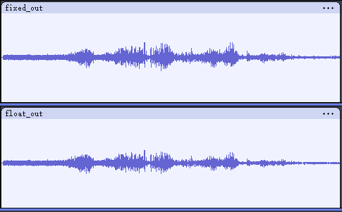

# SpeexDSP

Speex codec has been obsoleted by [Opus](https://opus-codec.org/), which is why there is no RISC-V implementation of Speex codec in this project. But we migrate SpeexDSP as it is frequently utilized for voice enhancement purposes.

The origin source code is available [here](https://www.speex.org/) or on [Gitlab](https://gitlab.xiph.org/xiph/speexdsp), current version is [release/1.2.1](https://gitlab.xiph.org/xiph/speexdsp).

We designed a `speexdsp_demo` to show how to implement **Acuostic Echo Cancellation** and **Audio Preprocess** by SpeexDSP. And we treat the results obtained from x86 platform as reference to verify the correctness of the migration.

## File Structure

| Directory | Description |
| -- | -- |
| src | SpeexDSP source files |
| inc | SpeexDSP header files |
| data | data manipulation source files and some test results |
| reference | same test code but run on x86 platform as a reference |

## Prerequests

Please refer to the [Prerequests](../README.md#prerequests) section in the README.md of parent directory.

## Build

SpeexDSP has both floating point and fixed-point implementation. Nuclei CPU support some extensions, such as B (Bitmanip) extension and P extension. So there are some build options for both floating point and fixed-point version.

First, change to the directory where [Makefile](./Makefile) is located. We take Nuclei N300 CPU as an example.

To build **fixed-point** version without extension:

```shell
make CORE=n300 ARCH_EXT= FIXED_POINT=1 all
```

To build **floating-point** version without extension:

```shell
make CORE=n300 ARCH_EXT= FIXED_POINT=0 all
```

To build **fixed-point** version with B and P extension:

```shell
make CORE=n300 ARCH_EXT=_zba_zbb_zbc_zbs_xxldspn3x FIXED_POINT=1 all
```

To build **floating-point** version with B and P extension:

```shell
make CORE=n300 ARCH_EXT=_zba_zbb_zbc_zbs_xxldspn3x FIXED_POINT=0 all
```

For more information about Nuclei CPU Architecture extension, please refer to [ARCH_EXT](https://doc.nucleisys.com/nuclei_sdk/develop/buildsystem.html#arch-ext) section in Nuclei SDK documentation.

## Functional Test

For the usage of SpeexDSP, please refer to the [official manual](https://gitlab.xiph.org/xiph/speexdsp/-/blob/release/1.2.1/doc/manual.pdf).

We use the API provided in the fllowing two header files to test the SpeexDSP.

- [speex_echo.h](./inc/speex/speex_echo.h): perform echo cancellation
- [speex_preprocess.h](./inc/speex/speex_preprocess.h): perform noise reduction, automatic gain control and residual echo cancellation

There is also an [example](https://gitlab.xiph.org/xiph/speexdsp/-/blob/release/1.2.1/libspeexdsp/testecho.c) provided in the origin source code.

The test diagram is shown below:



The audio captured by the microphone blends the near-end sound of people's voices with the far-end echo. This combined signal is then processed by the Acoustic Echo Cancellation (AEC) and a Preprocessor to filter out the unwanted echoes and noise. The audio card subsequently drives the filtered audio through the speaker, which is then looped back to the microphone and become the "echo" again.

The test inpus is a 2s duration of 16k sample rate PCM_S16LE raw audio data. The waveform of `input` is shown in the figure below, which is mixed with echo and noise.



The filtered result of `input` is shown as `fixed_out` and `float_out`, which correspond to the fixed-point and floating-point version respectively. The noise within the waveform is progressively diminished from start to finish, as the filter requires time to adaptively adjust its parameters for optimal noise reduction.



**Note**: This demo is just for reference, the filter parameters are not optimized.

## Performance Test

We statistics the CPU cycles used when calling `speex_echo_cancellation` and `speex_preprocess_run`, and calculate the average CPU cycles.

To show the performance of Nuclei CPU extensions, we compare the cpu cycles consumed between w/ and w/o extension. For w/o extension, the build option is `ARCH_EXT=`, for w/ extension, the build option is `ARCH_EXT=_zba_zbb_zbc_zbs_xxldspn3x`.

    Test bitstream: n300_dual_best_config_ku060_16M_7cd945994_18d811786_202408191002.bit

These results can be easily calculated by [data/bench/cmp.py](./data/bench/cmp.py).

### fixed-point

| case | w/o ext (avg cycles) | w/ ext (avg cycles) | speedup ratio |
| -- | -- | -- | -- |
| Acuostic Echo Cancellation | 993463.38 | 917489.85 | 1.08 |
| Preprocess | 346886.74 | 324023.81 | 1.07 |

### float-point

| case | w/o ext (avg cycles) | w/ ext (avg cycles) | speedup ratio |
| -- | -- | -- | -- |
| Acuostic Echo Cancellation | 17768170.62 | 14405761.30 | 1.23 |
| Preprocess | 5460720.98 | 4626516.92 | 1.18 |
