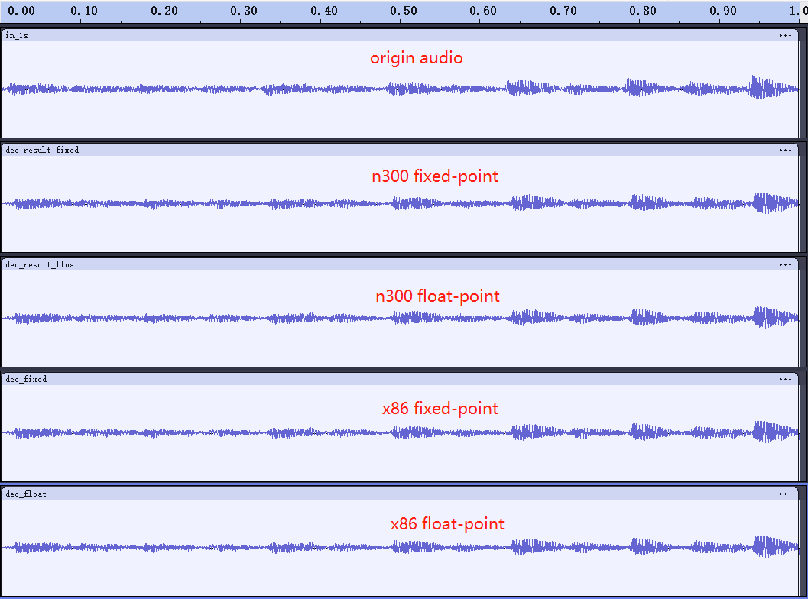

# Opus Codec

This is the [Opus](https://www.opus-codec.org/) encoder/decoder adapted for the Nuclei CPU.

The origin source code is available [here](https://github.com/xiph/opus), current version is [v1.5.2](https://github.com/xiph/opus/releases/tag/v1.5.2).

We did not compile the code into a library as in the original repository, but instead compiled the executable directly from the source code. `opus_demo` is a test program we designed, which is suitable for running directly on the bare-metal Nuclei CPU.

In `opus_demo`, we prepare a piece of audio data and first encode it by calling `opus_encode`, and then decode the encoded data by calling `opus_decode` to obtain the processed audio data.

- We analyze the processed audio data to ensure the correctness of the opus encoding and decoding functionality;
- We measure the execution time of `opus_encode` and `opus_decode` to assess their performance.

## File Structure

| Directory | Description |
| -- | -- |
| celt | celt source files which is a part of Opus |
| silk | silk source files which is a part of Opus |
| include | Opus header files |
| src | Opus source files |
| data | data manipulation source files and some test results |
| reference | same test code but run on operating system as a reference |

## Prerequests

We recommend utilizing the latest version of the Nuclei SDK and associated toolchain for optimal performance and compatibility. For this project we use the following versions:

- [Nuclei SDK version 0.6.0](https://github.com/Nuclei-Software/nuclei-sdk/releases/tag/0.6.0)
- [Nuclei Studio IDE for Linux version 2024.06](https://download.nucleisys.com/upload/files/nucleistudio/NucleiStudio_IDE_202406-lin64.tgz)

Please adhere to the instructions outlined in the [Setup Tools and Environment](https://doc.nucleisys.com/nuclei_sdk/quickstart.html#get-and-setup-nuclei-sdk) section to properly prepare your Nuclei SDK and toolchain for use. Both Linux and Windows operating systems are supported, for the purpose of example, we will demonstrate the process using the Ubuntu 20.04 Linux operating system.

It is recommended to setup `NUCLEI_SDK_ROOT` environment variable to point to `/path/to/nuclei-sdk`.

```shell
export NUCLEI_SDK_ROOT=/path/to/nuclei-sdk
```

After that, no matter where this project located in, you can run make to build and run the test program.

Otherwise, you should place this project in the directory of `$NUCLEI_SDK_ROOT/application/baremetal`

## Build

Opus has both floating point and fixed-point implementation. Nuclei CPU support some extensions, such as B (Bitmanip) extension and P extension, which can enhance the performance of the codec. So there are some different build options for both floating point and fixed-point version.

First, change to the directory where [Makefile](./Makefile) is located. We take Nuclei N300 CPU as an example.

To build **fixed-point** version without extension:

```shell
make CORE=n300 ARCH_EXT= FIXED_POINT=1 all
```

To build **floating-point** version without extension:

```shell
make CORE=n300 ARCH_EXT= FIXED_POINT=0 all
```

To build **fixed-point** version with B and P extension:

```shell
make CORE=n300 ARCH_EXT=_zba_zbb_zbc_zbs_xxldspn3x FIXED_POINT=1 all
```

To build **floating-point** version with B and P extension:

```shell
make CORE=n300 ARCH_EXT=_zba_zbb_zbc_zbs_xxldspn3x FIXED_POINT=0 all
```

For more information about Nuclei CPU Architecture extension, please refer to [ARCH_EXT](https://doc.nucleisys.com/nuclei_sdk/develop/buildsystem.html#arch-ext) section in Nuclei SDK documentation.

## Test

We have two `opus_demo.c` files, one [opus_demo.c](./opus_demo.c) is for Nulcei CPU, and the other [reference/opus_demo.c](./reference/opus_demo.c) is for running on operating system with File I/O.

The test audio is [in_1s.wav](./reference/in_1s.wav), which is a 1-second duration, 16k sample rate, PCM_S16LE format audio file. We extract the data from [in_1s.wav](./reference/in_1s.wav) to obtain [in_1s.raw](./reference/in_1s.raw).

For Nuclei CPU baremetal environment, we use `xxd` tool to convert the raw format file [in_1s.raw](./reference/in_1s.raw) into data stored in [data/in_1s.h](./data/in_1s.h).

When run on Nuclei CPU, we print the processed audio data to log file [data/test/n300_fixed.txt](./data/test/n300_fixed.txt) and [data/test/n300_float.txt](./data/test/n300_float.txt). And you can convert the data to raw format file by [to_raw.py](./data/test/to_raw.py).



Although these four audio are not exactly same, but they are very close to each other. And people can hardly tell the difference between them by ear.

## Benchmark

The encoder process 20 ms of audio data, so the 1s duration of audio data is divided into 50 frames. The decoder should follow inverse order, so the decoder should decode the frames for 50 times. We record the CPU cycles to process each frame, and caclulate the average cycles as shown in the following table.

For w/o extension, the build option is `ARCH_EXT=`, for w/ extension, the build option is `ARCH_EXT=_zba_zbb_zbc_zbs_xxldspn3x`.

These results can be easily calculated by [data/bench/cmp.py](./data/bench/cmp.py).

### fixed-point

| case | fixed-point w/o ext | fixed-point w/ ext | speedup ratio |
| -- | -- | -- | -- |
| encode (avg cycles) | 6951502.84 | 5968187.26 | 1.16 |
| decode (avg cycles) | 112640.22 | 110074.82 | 1.02 |

### float-point

| case | float-point w/o ext | float-point w/ ext | speedup ratio |
| -- | -- | -- | -- |
| encode (avg cycles) | 44398970.58 | 38056908.84 | 1.17 |
| decode (avg cycles) | 307887.96 | 266908.76 | 1.15 |
